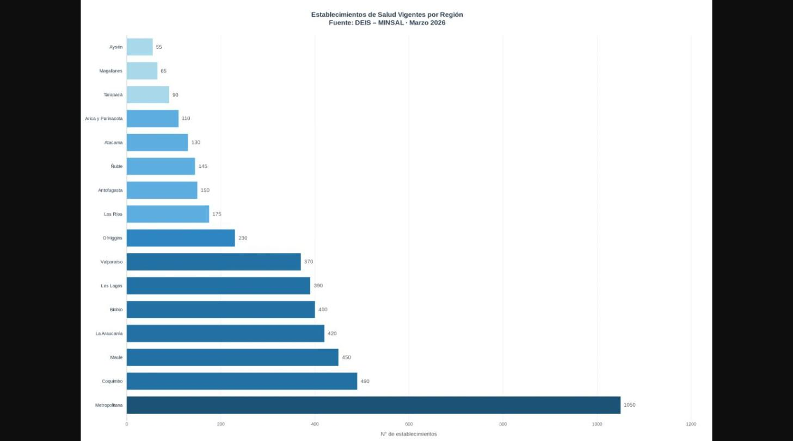
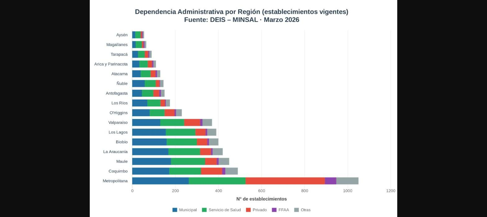
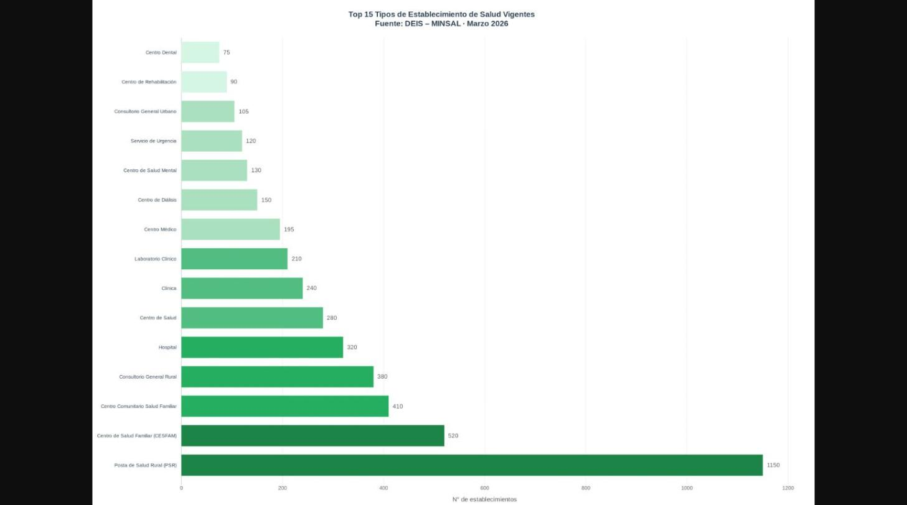
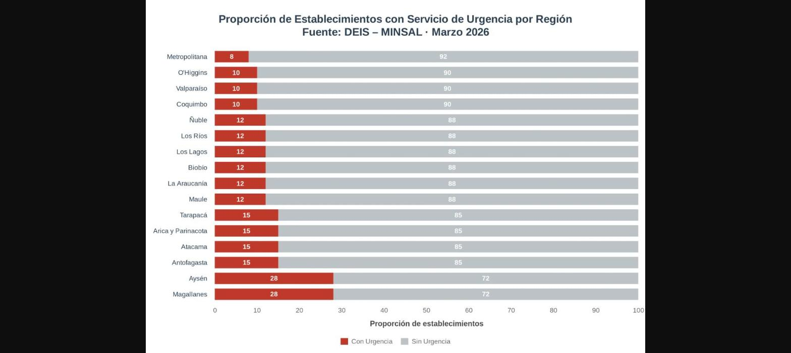

# 🏥 Análisis de Establecimientos de Salud en Chile


> Análisis exploratorio y descriptivo de la red de establecimientos de salud pública y privada en Chile, utilizando datos oficiales del Registro Nacional de Prestadores del Ministerio de Salud (MINSAL).

---

## 📋 Tabla de Contenidos

- [Descripción](#descripción)
- [Preguntas de Investigación](#preguntas-de-investigación)
- [Fuente de Datos](#fuente-de-datos)
- [Estructura del Repositorio](#estructura-del-repositorio)
- [Metodología](#metodología)
- [Hallazgos Principales](#hallazgos-principales)
- [Visualizaciones](#visualizaciones)
- [Requisitos](#requisitos)
- [Reproducibilidad](#reproducibilidad)
- [Autor](#autor)

---

## 📌 Descripción

Este proyecto explora la **distribución geográfica y características institucionales** de los establecimientos de salud en Chile, con foco en:

- La cobertura territorial de la red asistencial por región
- La composición según tipo de dependencia administrativa (pública vs. privada)
- Los tipos de establecimientos presentes en el sistema nacional
- La disponibilidad de servicios de urgencia a nivel regional

El análisis fue desarrollado íntegramente en **R** mediante un documento R Markdown reproducible, aplicando principios de ciencia de datos abierta y transparencia metodológica.

---

## ❓ Preguntas de Investigación

1. ¿Cómo se distribuyen los establecimientos de salud por región?
2. ¿Qué tipos de establecimientos predominan en la red asistencial pública vs. privada?
3. ¿Cómo se distribuye la cobertura de urgencia a nivel regional?
4. ¿Cuál es la composición de dependencia administrativa del sistema de salud?

---

## 📊 Fuente de Datos

| Campo | Detalle |
|---|---|
| **Institución** | Departamento de Estadísticas e Información de Salud (DEIS) – MINSAL |
| **Registro** | Registro Nacional de Prestadores Individuales e Institucionales |
| **Archivo** | `establecimientos_20260303.csv` |
| **Formato** | CSV delimitado por punto y coma (UTF-8) |
| **Actualización** | Marzo 2026 |
| **URL** | [https://deis.minsal.cl/](https://deis.minsal.cl/) |

---

## 🗂️ Estructura del Repositorio

```
salud-chile-analytics/
│
├── analisis_establecimientos.Rmd    # Documento R Markdown principal
├── establecimientos_20260303.csv    # Dataset fuente (DEIS - MINSAL)
│
├── 01_establecimientos_region.png   # Gráfico: Distribución por región
├── 02_dependencia_region.png        # Gráfico: Dependencia administrativa por región
├── 03_tipos_establecimiento.png     # Gráfico: Tipos de establecimiento
├── 04_urgencia_region.png           # Gráfico: Cobertura de urgencia por región
│
└── README.md                        # Este archivo
```

---

## 🔬 Metodología

### Pipeline de Análisis

```
Datos crudos (CSV)
      │
      ▼
Carga y exploración inicial
      │
      ▼
Limpieza y estandarización
 • Normalización de TieneServicioUrgencia → {Con Urgencia, Sin Urgencia, NA}
 • Estandarización de EstadoFuncionamiento (str_to_title)
 • Abreviación de nombres de regiones para visualización
      │
      ▼
Filtrado de establecimientos vigentes
      │
      ▼
Análisis exploratorio (4 dimensiones)
      │
      ▼
Visualizaciones con ggplot2
```

### Paquetes Utilizados

| Paquete | Versión | Uso |
|---|---|---|
| `tidyverse` | ≥ 2.0 | Manipulación y visualización de datos |
| `scales` | ≥ 1.3 | Formateo de ejes y etiquetas |
| `forcats` | ≥ 1.0 | Manejo de factores (`fct_reorder`, `fct_lump`) |
| `knitr` | ≥ 1.45 | Generación de tablas en el documento |
| `kableExtra` | ≥ 1.3 | Estilo profesional de tablas HTML |

### Parámetros del Documento

```yaml
output: html_document
  theme: flatly
  highlight: tango
  toc: true (flotante, profundidad 3)
  code_folding: show
  fig.width: 10 | fig.height: 6 | dpi: 150
```

---

## 🔎 Hallazgos Principales

> 📍 **Distribución Regional:** La Región Metropolitana concentra aproximadamente el **20% de todos los establecimientos del país**, seguida por regiones con alta ruralidad como Maule, Araucanía y Los Lagos, lo que refleja la red de Postas de Salud Rural distribuidas en territorio.

> 🏛️ **Dependencia Administrativa:** El sistema de salud chileno muestra una clara predominancia de la red **pública (SNSS)**, con presencia relevante del sector municipal a través de la Atención Primaria de Salud (APS).

> 🏨 **Tipos de Establecimiento:** Las **Postas de Salud Rural** y los **Centros de Salud Familiar (CESFAM)** constituyen los tipos más frecuentes, evidenciando la fortaleza de la estrategia de APS.

> 🚨 **Cobertura de Urgencia:** La distribución de servicios de urgencia presenta asimetrías regionales importantes, con menor cobertura relativa en regiones extremas del país.

---

## 📈 Visualizaciones

### 1. Establecimientos de Salud Vigentes por Región


### 2. Dependencia Administrativa por Región


### 3. Tipos de Establecimiento


### 4. Cobertura de Urgencia por Región


---

## ⚙️ Requisitos

### Software
- **R** ≥ 4.3.0
- **RStudio** ≥ 2023.x (recomendado) o VS Code con extensión R

### Instalación de dependencias

```r
install.packages(c(
  "tidyverse",
  "scales",
  "forcats",
  "knitr",
  "kableExtra"
))
```

---

## 🔄 Reproducibilidad

Para reproducir el análisis completo:

1. **Clonar** el repositorio:
   ```bash
   git clone https://github.com/ignaciocooaravena-sys/-salud-chile-analytics.git
   cd salud-chile-analytics
   ```

2. **Descargar** el dataset desde [DEIS MINSAL](https://deis.minsal.cl/) y guardarlo como `establecimientos_20260303.csv` en la raíz del proyecto.

3. **Renderizar** el documento R Markdown:
   ```r
   rmarkdown::render("analisis_establecimientos.Rmd")
   ```

4. El reporte HTML generado incluye todas las tablas, gráficos e interpretaciones con código plegable.

---

## 👤 Autor

**Ignacio Coo Aravena**

Análisis desarrollado como parte del estudio de datos de salud pública chilena. Datos actualizados a **marzo de 2026**.

---

## 📄 Licencia

Este proyecto está bajo la licencia **MIT**. Los datos utilizados son de dominio público y provienen de fuentes oficiales del Estado de Chile (MINSAL/DEIS).

---

*Última actualización: Marzo 2026 · Fuente: DEIS – Ministerio de Salud de Chile*
